# 宁渡 AI 心理健康咨询平台 —— UML 建模图

> 技术栈：Spring Boot 3 + MyBatis-Plus + Spring AI（阿里云百炼 / Ollama）+ Vue3 + Element Plus + SSE
> 以下图均依据项目真实代码绘制（7 实体、8 控制器、10 服务类）。Mermaid 源码可直接在支持 Mermaid 的 Markdown 查看器（VS Code 插件 / Typora / GitHub）中渲染。

---

## 1. 系统用例图（Use Case Diagram）

> Mermaid 无原生用例图，采用 flowchart 表示：圆角节点为用例，两侧为参与者。

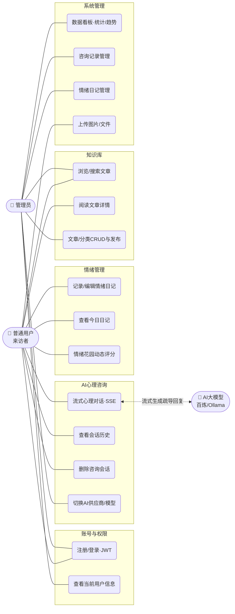

---

## 2. 领域模型类图（Domain Class Diagram）

> 仅保留核心业务字段（不含 getter/setter），关联标注多重性。

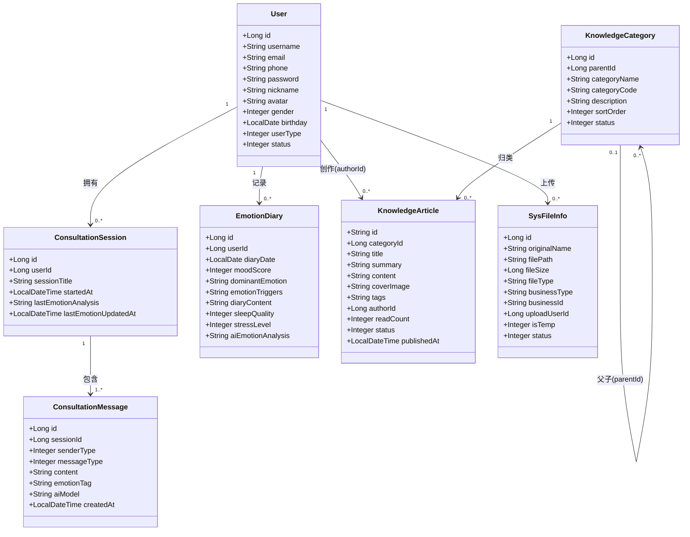

---

## 3. 分层架构类图（Layered Architecture）

> Controller → Service → Mapper（MyBatis-Plus BaseMapper）→ 数据库；AI 能力经 AiProviderManager 统一适配双供应商。

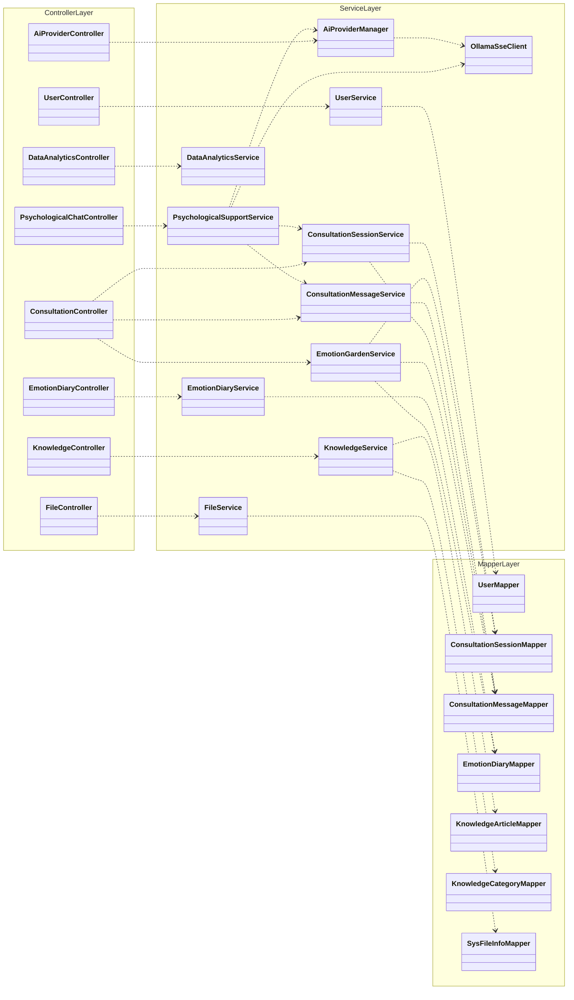

---

## 4. 实体关系图（ER Diagram）

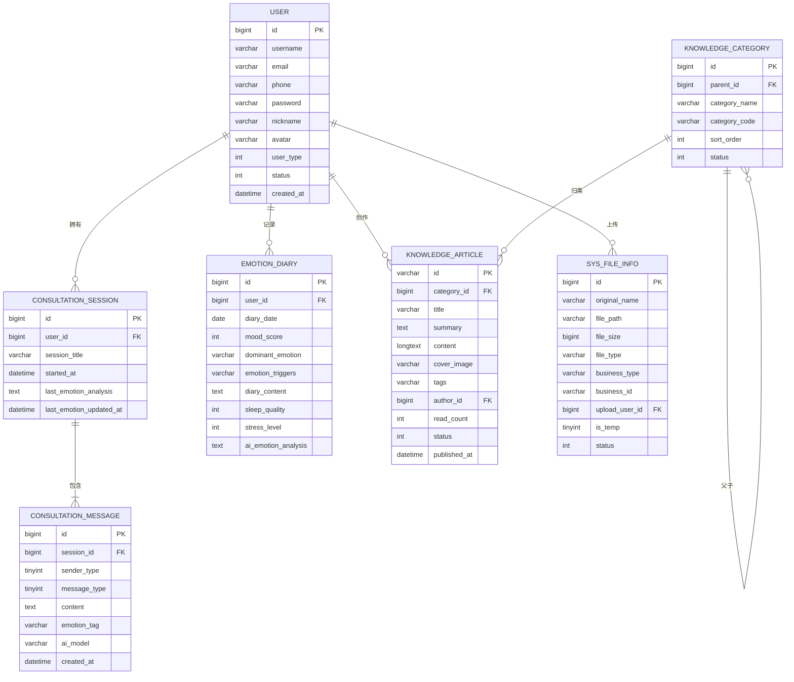

---

## 5. 时序图：用户登录（JWT 鉴权）

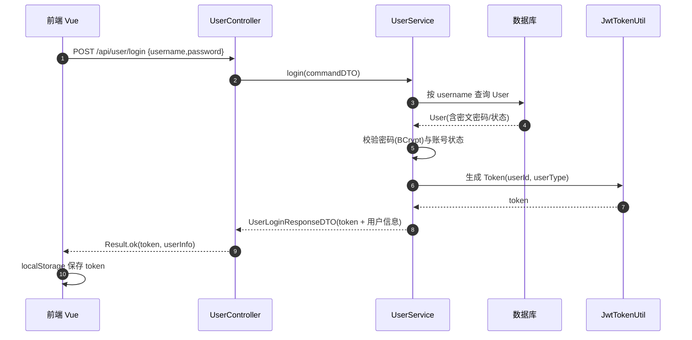

---

## 6. 时序图：AI 流式心理咨询（SSE 打字机）

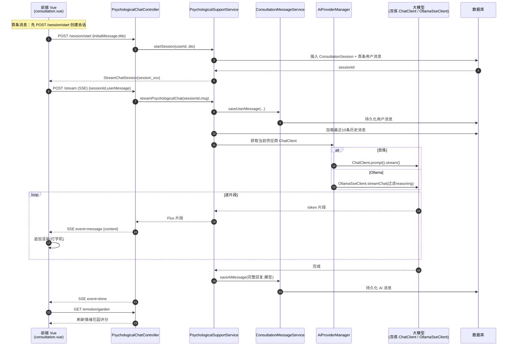

---

## 7. 时序图：情绪花园动态评分

> 近 14 天「情绪日记评分(权重0.6) + 对话关键词情感(权重0.4)」，含危机词风险分级。

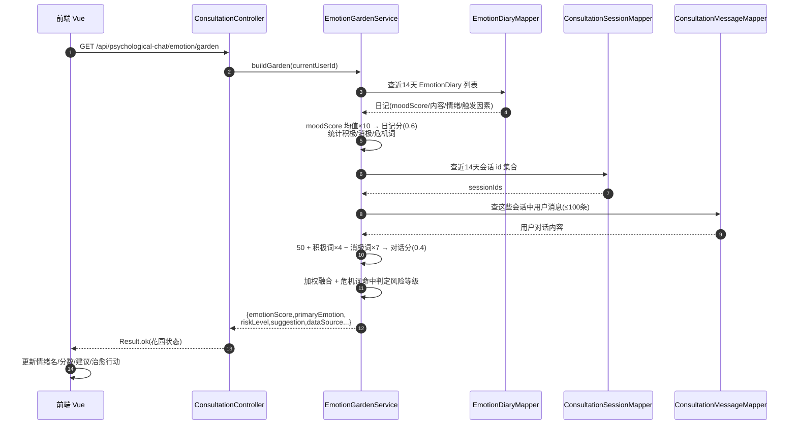

---

## 8. 时序图：情绪日记每日记录（同日唯一、再次编辑）

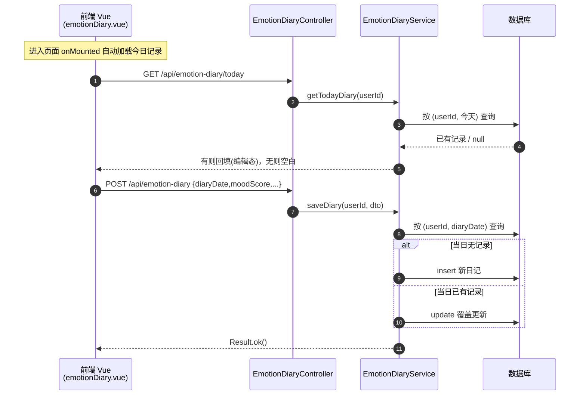

---

## 9. 时序图：知识库文章浏览与模糊搜索

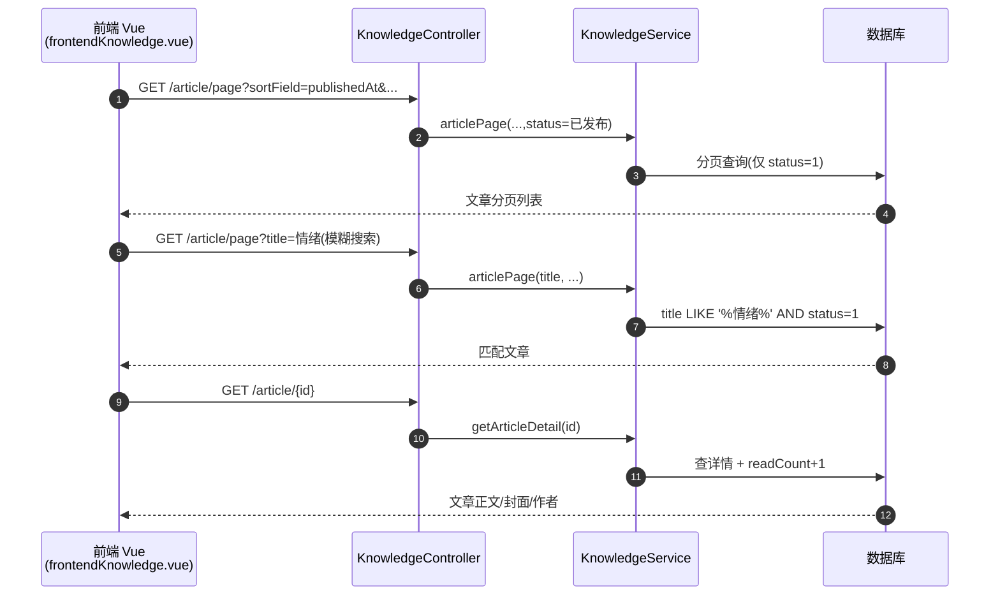

---

## 10. 状态图：知识库文章生命周期

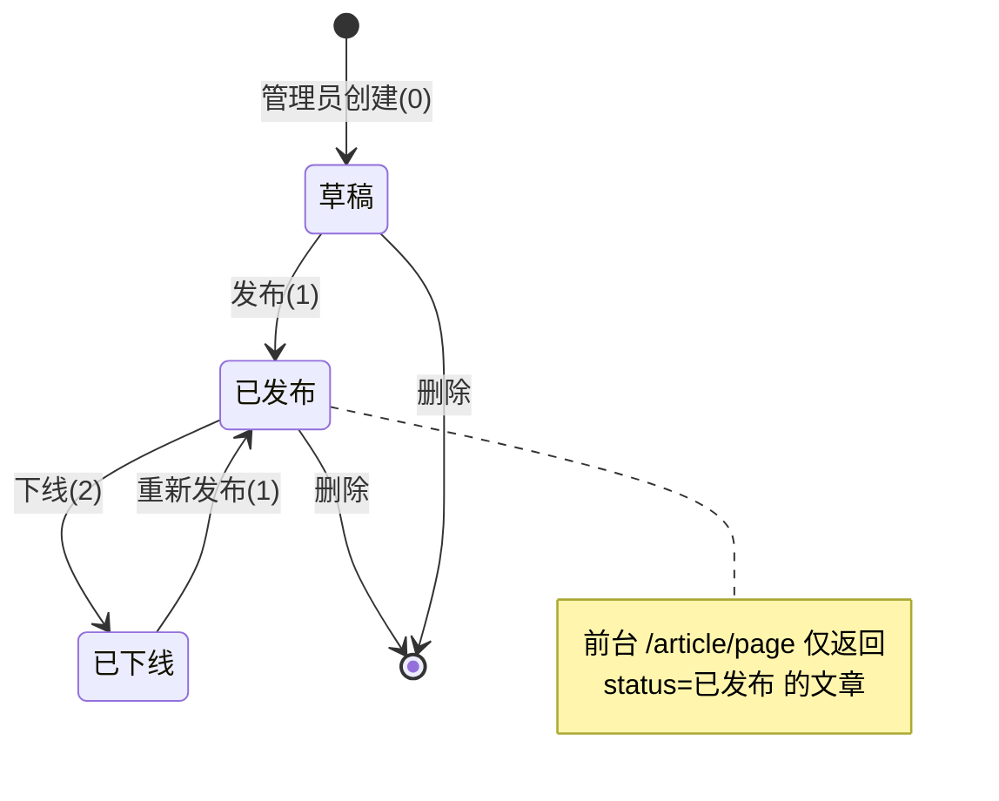

---

## 11. 活动图：AI 供应商运行时切换（管理员）

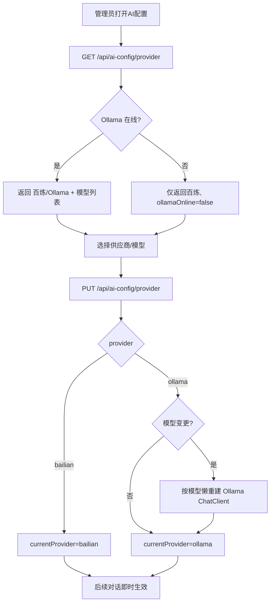
